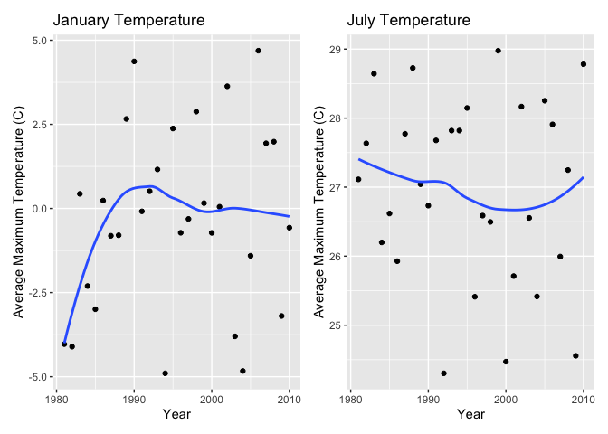
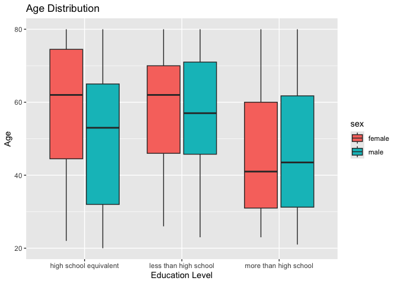
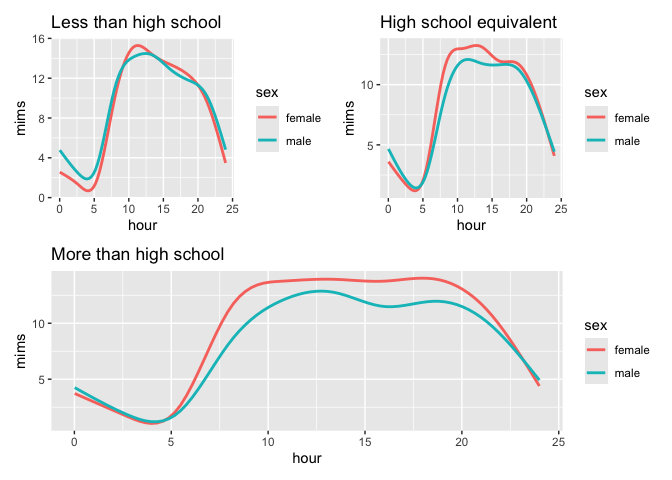
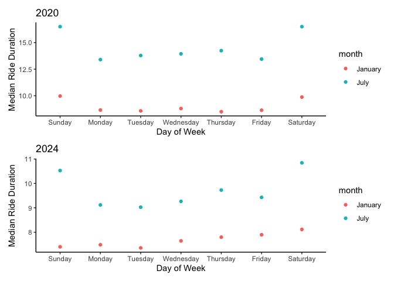
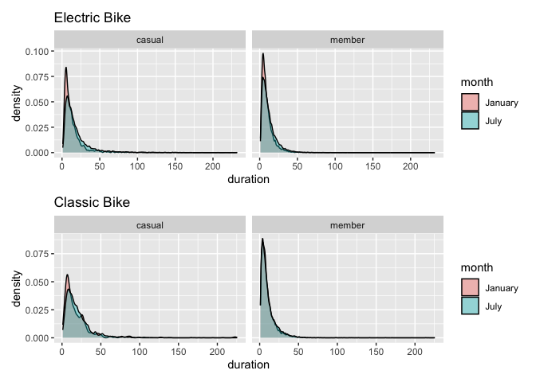

P8105 Homework 3
================
Riyadh Baksh
2024-10-10

# Problem 1

The data contained in `ny_noaa` provides information about the weather
in New York on various dates. There are a total of 7 variables (columns)
and 2,595,176 observations (rows). For each date, there are 5 metrics,
including precipitation, snow, snow depth, maximum temperature, and
minimum temperature. There is also an id variable. At a glance, there is
a lot of missing data, across many variables.

``` r
library(tidyverse)
library(p8105.datasets)

data("ny_noaa")

ny_noaa
```

    ## # A tibble: 2,595,176 × 7
    ##    id          date        prcp  snow  snwd tmax  tmin 
    ##    <chr>       <date>     <int> <int> <int> <chr> <chr>
    ##  1 US1NYAB0001 2007-11-01    NA    NA    NA <NA>  <NA> 
    ##  2 US1NYAB0001 2007-11-02    NA    NA    NA <NA>  <NA> 
    ##  3 US1NYAB0001 2007-11-03    NA    NA    NA <NA>  <NA> 
    ##  4 US1NYAB0001 2007-11-04    NA    NA    NA <NA>  <NA> 
    ##  5 US1NYAB0001 2007-11-05    NA    NA    NA <NA>  <NA> 
    ##  6 US1NYAB0001 2007-11-06    NA    NA    NA <NA>  <NA> 
    ##  7 US1NYAB0001 2007-11-07    NA    NA    NA <NA>  <NA> 
    ##  8 US1NYAB0001 2007-11-08    NA    NA    NA <NA>  <NA> 
    ##  9 US1NYAB0001 2007-11-09    NA    NA    NA <NA>  <NA> 
    ## 10 US1NYAB0001 2007-11-10    NA    NA    NA <NA>  <NA> 
    ## # ℹ 2,595,166 more rows

The dates are separated into 3 columns representing the year, month, and
date. The units are changed to more commonly used values. Precipitation
is converted to mm, instead of tenths of mm. Temperature is reported in
Celsius, instead of tenths of Celsius. Snow depth is reported in inches,
instead of mm. These were all done because of normal conventions.
Snowfall is reported in tenths of inches because often it is a small
amount of snow that falls per period of time.

``` r
ny_noaa =
  mutate(ny_noaa,
         year = year(date),
         month = month(date),
         day = day(date),
         prcp = as.numeric(prcp)/10, # convert to mm from tenths of mm
         tmax = as.numeric(tmax)/10, # convert to C from tenths of C
         tmin = as.numeric(tmin)/10, # convert to C from tenths of C
         snow = as.numeric(snow)/25.4*10, # convert to tenths of inches from mm
         snwd = as.numeric(snwd)/25.4 # convert to inches from mm
         )
```

The average snowfall is 1.96 tenths of an inch. This makes sense since
for much of the year, there is no snowfall, so it brings down the
average.

The plots below show the average max temperature in January and July,
across all stations, for each year. There is a lot of scatter, but
roughly in January the average max temperature increased and then
plateaued, whereas for July, it stayed about the same. That being said,
there are a lot of points that don’t follow this pattern. Due to this
large scatter, it’s difficult to say whether there are outliers, since
there isn’t a clear pattern.

``` r
library(patchwork)

january =
  ny_noaa |>
  drop_na(tmax) |>
  filter(month==1) |>
  group_by(year) |>
  summarize(mean_tmax = mean(tmax, na.rm=TRUE)) |>
  ggplot(aes(x=year,y=mean_tmax)) +
    geom_point() +
    geom_smooth(se=FALSE) +
    labs(
      title = "January Temperature",
      x = "Year",
      y = "Average Maximum Temperature (C)"
    )

july =
  ny_noaa |>
  drop_na(tmax) |>
  filter(month==7) |>
  group_by(year) |>
  summarize(mean_tmax = mean(tmax, na.rm=TRUE)) |>
  ggplot(aes(x=year,y=mean_tmax)) +
    geom_point() +
    geom_smooth(se=FALSE) +
    labs(
      title = "July Temperature",
      x = "Year",
      y = "Average Maximum Temperature (C)"
    )

(january + july)
```

<!-- -->

``` r
tmax_tmin =
  ny_noaa |>
  drop_na(tmax, tmin) |>
  ggplot(aes(x=tmax,y=tmin)) +
    geom_point(alpha = 0.5) +
    geom_smooth(se=FALSE) +
    labs(
      title = "Temperature Plot",
      x = "Minimum Temperature (C)",
      y = "Maximum Temperature (C)"
    )

snowfall =
  ny_noaa |>
  select(year,snow) |>
  drop_na(snow) |>
  filter(snow>0, snow<100) |>
  ggplot(aes(x=year,y=snow)) +
    geom_boxplot(aes(group=year)) +
    labs(
      title = "Snowfall Distribution",
      x = "Year",
      y = "Snowfall (Tenths of Inch)"
    )

(tmax_tmin + snowfall)
```

<!-- -->

# Problem 2

The demographic dataset is loaded and tidied below.

``` r
demo = 
  read_csv(file = "data/nhanes_covar.csv", skip=4) |>
  janitor::clean_names() |>
  mutate(
    sex = case_match(
      sex,
      1 ~ "male",
      2 ~ "female"
    ),
    education = case_match(
      education,
      1 ~ "less than high school",
      2 ~ "high school equivalent",
      3 ~ "more than high school"
    ),
    sex = as.factor(sex),
    education = as.factor(education),
    age = as.integer(age)
  )
```

    ## Rows: 250 Columns: 5
    ## ── Column specification ────────────────────────────────────────────────────────
    ## Delimiter: ","
    ## dbl (5): SEQN, sex, age, BMI, education
    ## 
    ## ℹ Use `spec()` to retrieve the full column specification for this data.
    ## ℹ Specify the column types or set `show_col_types = FALSE` to quiet this message.

``` r
demo
```

    ## # A tibble: 250 × 5
    ##     seqn sex      age   bmi education             
    ##    <dbl> <fct>  <int> <dbl> <fct>                 
    ##  1 62161 male      22  23.3 high school equivalent
    ##  2 62164 female    44  23.2 more than high school 
    ##  3 62169 male      21  20.1 high school equivalent
    ##  4 62174 male      80  33.9 more than high school 
    ##  5 62177 male      51  20.1 high school equivalent
    ##  6 62178 male      80  28.5 high school equivalent
    ##  7 62180 male      35  27.9 more than high school 
    ##  8 62184 male      26  22.1 high school equivalent
    ##  9 62186 female    17  22.9 <NA>                  
    ## 10 62189 female    30  22.4 more than high school 
    ## # ℹ 240 more rows

The accelerometer data is loaded and tided below.

``` r
accel = 
  read_csv(file = "data/nhanes_accel.csv") |>
  janitor::clean_names()
```

    ## Rows: 250 Columns: 1441
    ## ── Column specification ────────────────────────────────────────────────────────
    ## Delimiter: ","
    ## dbl (1441): SEQN, min1, min2, min3, min4, min5, min6, min7, min8, min9, min1...
    ## 
    ## ℹ Use `spec()` to retrieve the full column specification for this data.
    ## ℹ Specify the column types or set `show_col_types = FALSE` to quiet this message.

Next, the two datasets are combined and further tidying is done. This
now prepares the final dataset in `mims`.

``` r
mims =
  left_join(demo,accel,by="seqn") |>
  drop_na(sex:education) |>
  filter(age>=21) |>
  pivot_longer(
    min1:last_col(),
    names_to = "minute",
    names_prefix = "min",
    values_to = "mims"
  )

mims
```

    ## # A tibble: 328,320 × 7
    ##     seqn sex     age   bmi education              minute  mims
    ##    <dbl> <fct> <int> <dbl> <fct>                  <chr>  <dbl>
    ##  1 62161 male     22  23.3 high school equivalent 1      1.11 
    ##  2 62161 male     22  23.3 high school equivalent 2      3.12 
    ##  3 62161 male     22  23.3 high school equivalent 3      1.47 
    ##  4 62161 male     22  23.3 high school equivalent 4      0.938
    ##  5 62161 male     22  23.3 high school equivalent 5      1.60 
    ##  6 62161 male     22  23.3 high school equivalent 6      0.145
    ##  7 62161 male     22  23.3 high school equivalent 7      2.10 
    ##  8 62161 male     22  23.3 high school equivalent 8      0.509
    ##  9 62161 male     22  23.3 high school equivalent 9      1.63 
    ## 10 62161 male     22  23.3 high school equivalent 10     1.20 
    ## # ℹ 328,310 more rows

The table below shows the number of men and women in each education
category. There are more males in high school equivalent, whereas about
the same male and female in the other educations. There are overall more
people in “more than high school” than “high school equivalent” than
“less than high school”.

``` r
demo |>
  drop_na() |>
  janitor::tabyl(education, sex)
```

    ##               education female male
    ##  high school equivalent     23   36
    ##   less than high school     28   27
    ##   more than high school     59   56

The grouped boxplot below shows the age distribution for male and female
at each education level. There is a lot of spread, but the median age is
lowest for those with “more than high school” education. Males have a
median age younger than females for all educations, except “more than
high school”.

``` r
demo |>
  select(education,sex,age) |>
  drop_na() |>
  ggplot(aes(x=education,y=age,fill=sex)) +
    geom_boxplot() +
    labs(
      title = "Age Distribution",
      x = "Education Level",
      y = "Age"
    )
```

<!-- -->

The plots below show the sum of the MIMS for each individual, across
ages, between male and female, and for each education level. In general,
as you get older, the total MIMS decreases. For “less than high school”,
males typically have higher MIMS (except at young ages), whereas for the
other education levels, females typically have higher MIMS.

``` r
less =
  mims |>
  filter(education=="less than high school") |>
  aggregate(mims ~ seqn, sum) |>
  left_join(demo,by="seqn") |>
  ggplot(aes(x=age,y=mims)) +
    geom_point(aes(color=sex)) +
    geom_smooth(aes(color=sex),se=FALSE) +
    labs(title="Less than high school")

more =
  mims |>
  filter(education=="more than high school") |>
  aggregate(mims ~ seqn, sum) |>
  left_join(demo,by="seqn") |>
  ggplot(aes(x=age,y=mims)) +
    geom_point(aes(color=sex)) +
    geom_smooth(aes(color=sex),se=FALSE) +
    labs(title="More than high school")

equiv =
  mims |>
  filter(education=="high school equivalent") |>
  aggregate(mims ~ seqn, sum) |>
  left_join(demo,by="seqn") |>
  ggplot(aes(x=age,y=mims)) +
    geom_point(aes(color=sex)) +
    geom_smooth(aes(color=sex),se=FALSE) +
    labs(title="High school equivalent")

(less+equiv)/more
```

<!-- -->

The plots below show the MIMS value at each hour for both male and
female, for different education levels, but across all ages. In general,
females have higher MIMS throughout the day. Across all educations, MIMS
decreases than increases to a peak in the middle, then decreases again.
This could reflect the decreasing movement as people are falling asleep,
then the greater movement that peaks in the middle of the day, then the
decreasing movement towards the night.

``` r
less =
  mims |>
  filter(education=="less than high school") |>
  ggplot(aes(x=as.numeric(minute)/60,y=mims)) +
    geom_smooth(aes(color=sex),se=FALSE) +
    labs(
      title="Less than high school",
      x="hour")

more =
  mims |>
  filter(education=="more than high school") |>
  ggplot(aes(x=as.numeric(minute)/60,y=mims)) +
    geom_smooth(aes(color=sex),se=FALSE) +
    labs(
      title="More than high school",
      x="hour")

equiv =
  mims |>
  filter(education=="high school equivalent") |>
  ggplot(aes(x=as.numeric(minute)/60,y=mims)) +
    geom_smooth(aes(color=sex),se=FALSE) +
    labs(
      title="High school equivalent",
      x="hour")

(less+equiv)/more
```

<!-- -->

# Problem 3

The datasets are loaded below, cleaned, and tidied. They are combined
into one dataset. The resulting dataset `citi` contains 9 variables
(columns) and 99,253 observations (rows). The variables include bike
type (whether electric or classic), day of week, duration of ride, start
and end station names, whether the rider is a member or casual, and the
date separated into the month and year.

``` r
Jan20 = 
  read_csv(file = "data/citibike/Jan 2020 Citi.csv") |>
  mutate(
    month="January",
    year="2020")

Jul20 =
  read_csv(file = "data/citibike/July 2020 Citi.csv") |>
  mutate(
    month="July",
    year="2020"
  )

Jan24 = 
  read_csv(file = "data/citibike/Jan 2024 Citi.csv") |>
  mutate(
    month="January",
    year="2024")

Jul24 =
  read_csv(file = "data/citibike/July 2024 Citi.csv") |>
  mutate(
    month="July",
    year="2024"
  )

citi =
  bind_rows(Jan20, Jul20, Jan24, Jul24) |>
  janitor::clean_names() |>
  drop_na()
```

The table below shows the number of rides for each date by casual and
members. Overall, for the same date, there are many more members taking
rides, rather than casual riders. In general, January ridership is lower
than July, which makes sense as the weather gets warmer, more people
would choose to ride a bike.

``` r
citi |>
  group_by(month, year) |>
  summarize(
    members=sum(member_casual=="member"),
    casuals=sum(member_casual=="casual")
  )
```

    ## # A tibble: 4 × 4
    ## # Groups:   month [2]
    ##   month   year  members casuals
    ##   <chr>   <chr>   <int>   <int>
    ## 1 January 2020    11418     980
    ## 2 January 2024    16705    2094
    ## 3 July    2020    15388    5625
    ## 4 July    2024    36200   10843

The table below shows the 5 most popular starting stations, according to
the number of rides originating from these stations acorss all months
and years.

``` r
station_rides = 
  citi |>
    group_by(start_station_name) |>
    summarize(rides=n())

head(arrange(station_rides, desc(rides)), 5)
```

    ## # A tibble: 5 × 2
    ##   start_station_name      rides
    ##   <chr>                   <int>
    ## 1 W 21 St & 6 Ave           427
    ## 2 University Pl & E 14 St   347
    ## 3 12 Ave & W 40 St          344
    ## 4 West St & Chambers St     339
    ## 5 1 Ave & E 68 St           333

Based on the plot below, typically, ride duration increases on the
weekends and decreases during the week. Overall, ride duration is higher
in July than in January. Further, ride duration was on average longer in
2020 than in 2024.

``` r
bike20 =
  citi |>
  filter(year=="2020") |>
  group_by(month,weekdays=factor(weekdays,levels=c("Sunday","Monday","Tuesday","Wednesday","Thursday","Friday","Saturday"))) |>
  summarize(median_duration=median(duration)) |>
  ggplot(aes(x=weekdays,y=median_duration, color=month)) +
    geom_point() +
    labs(
      title="2020",
      y="Median Ride Duration",
      x="Day of Week"
    ) +
    theme_classic()

bike24 =
  citi |>
  filter(year=="2024") |>
  group_by(month,weekdays=factor(weekdays,levels=c("Sunday","Monday","Tuesday","Wednesday","Thursday","Friday","Saturday"))) |>
  summarize(median_duration=median(duration)) |>
  ggplot(aes(x=weekdays,y=median_duration, color=month)) +
    geom_point() +
    labs(
      title="2024",
      y="Median Ride Duration",
      x="Day of Week"
    ) +
    theme_classic()
    
bike20/bike24
```

<!-- -->

The plots below show the effect of bike type, membership status, and
month, on ride duration in 2024. In general, the distribution is more
concentration at lower times in January, than in July. Conversely, in
July, there are more longer rides, which stretches the distribution.
Interestingly, being a member and using an electric bike also
concentrates the ride durations towards the shorter end. In other words,
it is more likely to have a shorter ride being a member on an electric
bike.

``` r
elec =
  citi |>
  filter(year=="2024",rideable_type=="electric_bike") |>
  ggplot(aes(x=duration, fill=month)) +
    geom_density(alpha = 0.4, adjust=0.5,color="black") +
    facet_grid(~member_casual) +
    labs(title="Electric Bike")

reg =
  citi |>
  filter(year=="2024",rideable_type=="classic_bike") |>
  ggplot(aes(x=duration, fill=month)) +
    geom_density(alpha = 0.4, adjust=0.5,color="black") +
    facet_grid(~member_casual) +
    labs(title="Classic Bike")


elec/reg
```

<!-- -->
